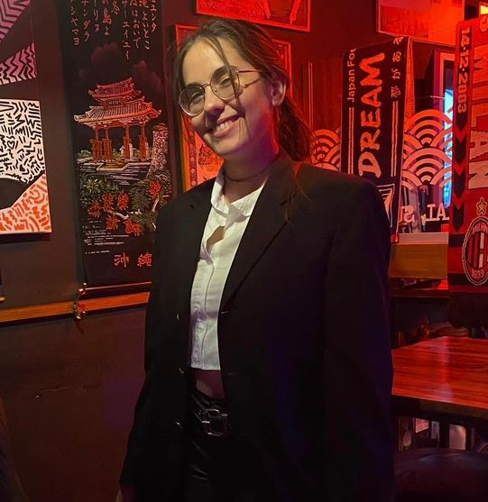

## Yo soy...
# Araceli Maldonado :sunglasses:

Holis! ¿Que tal? 
Estoy cursando mi cuarto cuatrimestre de la carrera, y ojalá recibirme el año que viene :pray:
Inicie la tecnicatura en programacion decidiendome cambiar la carrera de la licenciatura en kinesiologia
cuando estaba cerca de la fecha, real no me arrepiento de haber tomado la decisión.

Me gusta mucho jugar principalmente al LOL y quzias ya mas otros juegos de modo historia o mundo abierto, de esa indole
por ejemplo podria ser el Genshin Impact o ZZZ que jugue ultimamente.
Otro hobby que tengo es mirar anime, mi favorito en este momento es One Piece, si no mas romantico quizas sería Ao Haru Ride.

Quiero poder aprender mucho mas de la programación. Realmente tiene tantas cosas que ver que aun me cuesta decidir a que lenguaje me gustaria dedicarme, lo unico claro hasta ahora es que probablemente voy a adentrarme mucho mas al Back End.

Actualmente estoy trabajando en un local de ropa hace 2 años, pero realmente me gustaria poder cambiar de trabajo aunque la cosa esta dificil, pero obvio que hay que seguir buscando y avanzar mientras tanto en la carrera sin dejar de aprender y meterle mucho a la carrera.

- Espero podamos tener un cuatrimestre buenisimo 🤍 Muchos exitos a todos.
